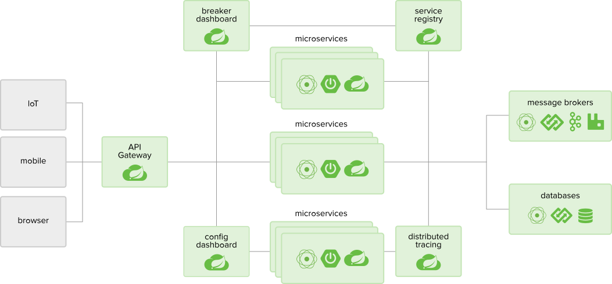

# 第一节 架构

Spring Cloud为分布式系统模式提供了简单易用的编程模型，帮助开发人员构建弹性，可靠和协调的应用程序。Spring Cloud构建于Spring Boot之上，使开发人员可以轻松入门并快速提高工作效率。

**服务发现**

&emsp;&emsp;一种动态目录，支持客户端负载平衡和智能路由

**断路器**

&emsp;&emsp;控制器具有监控仪表板的容错功能

**配置服务器**

&emsp;&emsp;为分散式应用程序提供动态，集中的配置管理

**API网关**

&emsp;&emsp;API消费者的单一入口点（例如，浏览器，设备，其他API）

**分布式跟踪**

&emsp;&emsp;分布式系统的自动化应用程序检测和操作可见性

**OAuth2**

&emsp;&emsp;支持单点登录，令牌中继和令牌交换

**消费者驱动的契约**

&emsp;&emsp;服务演化模式，以支持基于HTTP和基于消息的API