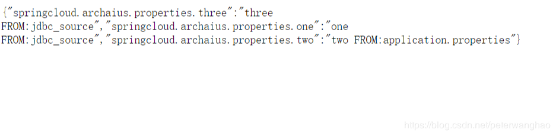

# Archaius之多数据源

## 1.概述

Netflix Archaius提供了用于连接许多数据源的类库和功能。

在本教程中，我们将学习如何获取配置：

 - 使用JDBC API连接到数据库   
 - 读取来自存储在DynamoDB实例中的配置   
 - 通过Zookeeper配置为动态分布式配置

有关Netflix Archaius的介绍，请[查看本文](https://blog.csdn.net/peterwanghao/article/details/83834297)。

## 2.将Netflix Archaius与JDBC连接一起使用

正如我们在介绍性教程中所解释的，每当我们希望Archaius处理配置时，我们都需要创建一个Apache的AbstractConfiguration bean。

Bean将由Spring Cloud Bridge自动捕获并添加到Archaius的Composite Configuration堆栈中。

### 2.1 依赖

使用JDBC连接到数据库所需的所有功能都包含在核心库中，因此除了我们在介绍性教程中提到的那些之外，我们不需要任何额外的依赖：
```
<dependency>
	<groupId>org.springframework.cloud</groupId>
	<artifactId>spring-cloud-starter-netflix-archaius</artifactId>
</dependency>
```

### 2.2 如何创建配置Bean

在这种情况下，我们需要使用JDBCConfigurationSource实例创建AbstractConfiguration bean 。

为了说明如何从JDBC数据库获取值，我们必须指定：

 - 一个javax.sql.Datasource对象   
 - 一个SQL查询字符串，它将使用配置的键及其对应的值检索至少两列   
 - 两列分别表示属性键和值

让我们继续创建这个bean：
```
@Autowired
DataSource h2DataSource;

@Bean
public AbstractConfiguration addApplicationPropertiesSource() {
	PolledConfigurationSource source = new JDBCConfigurationSource(h2DataSource,
			"select distinct key, value from properties", "key", "value");
	return new DynamicConfiguration(source, new FixedDelayPollingScheduler());
}
```

### 2.3 示例

为了保持简单并且仍然有一个操作示例，我们将使用一些初始数据设置H2内存数据库实例。

为此，我们首先添加必要的依赖项：
```
<dependency>
	<groupId>org.springframework.boot</groupId>
	<artifactId>spring-boot-starter-data-jpa</artifactId>
</dependency>
<dependency>
	<groupId>com.h2database</groupId>
	<artifactId>h2</artifactId>
	<scope>runtime</scope>
</dependency>
```
接下来，我们将声明将包含我们的属性的JPA实体：
```
@Entity
public class Properties {

	@Id
	private String key;

	@SuppressWarnings("unused")
	private String value;
}
```
我们将在我们的资源中包含一个data.sql文件，用一些初始值填充内存数据库：
```
insert into properties
values('springcloud.archaius.properties.one', 'one FROM:jdbc_source');

insert into properties
values('springcloud.archaius.properties.three', 'three FROM:jdbc_source');
```

最后，要检查任何给定点的属性值，我们可以创建一个端点来检索由Archaius管理的值：
```
@RestController
public class ConfigPropertiesController {

	private DynamicStringProperty propertyOneWithDynamic = DynamicPropertyFactory.getInstance()
			.getStringProperty("springcloud.archaius.properties.one", "not found!");

	private DynamicStringProperty propertyTwoWithDynamic = DynamicPropertyFactory.getInstance()
			.getStringProperty("springcloud.archaius.properties.two", "not found!");

	private DynamicStringProperty propertyThreeWithDynamic = DynamicPropertyFactory.getInstance()
			.getStringProperty("springcloud.archaius.properties.three", "not found!");

	@GetMapping("/properties-from-dynamic")
	public Map<String, String> getPropertiesFromDynamic() {
		Map<String, String> properties = new HashMap<>();
		properties.put(propertyOneWithDynamic.getName(), propertyOneWithDynamic.get());
		properties.put(propertyTwoWithDynamic.getName(), propertyTwoWithDynamic.get());
		properties.put(propertyThreeWithDynamic.getName(), propertyThreeWithDynamic.get());
		return properties;
	}
}
```
如果数据在任何时候发生变化，Archaius将在运行时检测到它并开始检索新值。

访问地址 http://localhost:8082/properties-from-dynamic




## 3.如何使用DynamoDB实例创建配置源

DynamoDB是AWS上完全托管的NoSQL数据库，类似于其他NoSQL数据库，如Cassandra或MongoDB。DynamoDB提供快速，一致和可预测的性能，并且具有大规模可扩展性。

首先需要在本地启动DynamoDB实例。可从[官网](https://docs.aws.amazon.com/amazondynamodb/latest/developerguide/DynamoDBLocal.html)下载dynamodb_local_latest.zip。

解压后在命令行中输入下面命令启动
```
 java -Djava.library.path=./DynamoDBLocal_lib -jar DynamoDBLocal.jar -sharedDb
```

### 3.1 依赖

我们将以下库添加到我们的pom.xml文件中：
```
<dependencies>
	<dependency>
		<groupId>com.amazonaws</groupId>
		<artifactId>aws-java-sdk-dynamodb</artifactId>
	</dependency>
	<dependency>
		<groupId>com.github.derjust</groupId>
		<artifactId>spring-data-dynamodb</artifactId>
		<version>${spring.dynamo.version}</version>
	</dependency>
	<dependency>
		<groupId>com.netflix.archaius</groupId>
		<artifactId>archaius-aws</artifactId>
		<version>${archaius.version}</version>
	</dependency>
</dependencies>

<properties>
	<spring.dynamo.version>4.5.0</spring.dynamo.version>
	<archaius.version>0.7.6</archaius.version>
</properties>
```

在  AWS-java的SDK-dynamodb依存库将允许我们建立DynamoDB客户端连接到数据库。

使用  spring-data-dynamodb库，我们将设置DynamoDB存储库。

最后，我们将使用archaius-aws库来创建AbstractConfiguration。

### 3.2 使用DynamoDB作为配置源

这次，将使用DynamoDbConfigurationSource对象创建AbstractConfiguration ：
```
@Autowired
AmazonDynamoDB amazonDynamoDb;

@Bean
public AbstractConfiguration addApplicationPropertiesSource() {
    initDatabase();
    PolledConfigurationSource source = new DynamoDbConfigurationSource(amazonDynamoDb);
    return new DynamicConfiguration(source, new FixedDelayPollingScheduler());
}
```

默认情况下，Archaius会搜索名为“archaiusProperties”的表，其中包含Dynamo数据库中的“key”和“value”属性，以用作源。

如果我们想要覆盖这些值，我们必须声明以下系统属性：
 - com.netflix.config.dynamo.tableName   
 - com.netflix.config.dynamo.keyAttributeName   
 - com.netflix.config.dynamo.valueAttributeName

### 3.3 创建一个功能齐全的示例

我们将首先安装一个本地DynamoDB实例来轻松测试功能。

要使用一些初始数据填充数据库，我们将首先创建一个DynamoDBTable实体来映射数据：
```
@DynamoDBTable(tableName = "archaiusProperties")
public class ArchaiusProperties {

	@DynamoDBHashKey
	@DynamoDBAttribute
	private String key;

	@DynamoDBAttribute
	private String value;
}
```

接下来，我们将为此实体创建一个CrudRepository：
```
public interface ArchaiusPropertiesRepository extends CrudRepository<ArchaiusProperties, String> {

}
```

最后，我们将使用存储库和AmazonDynamoDB实例创建表并在之后插入数据：
```
@Autowired
AmazonDynamoDB amazonDynamoDb;

@Autowired
private ArchaiusPropertiesRepository repository;

private void initDatabase() {
   // Create the table
   DynamoDBMapper mapper = new DynamoDBMapper(amazonDynamoDb);
   CreateTableRequest tableRequest = mapper.generateCreateTableRequest(ArchaiusProperties.class);
   tableRequest.setProvisionedThroughput(new ProvisionedThroughput(1L, 1L));
   TableUtils.createTableIfNotExists(amazonDynamoDb, tableRequest);

   // Populate the table
   ArchaiusProperties property = new ArchaiusProperties("springcloud.archaius.properties.one", "one FROM:dynamoDB");
   ArchaiusProperties property3 = new ArchaiusProperties("springcloud.archaius.properties.three", "three FROM:dynamoDB");
   repository.save(Arrays.asList(property, property3));
}
```

我们可以在创建DynamoDbConfigurationSource之前调用此方法。


## 4.如何设置动态Zookeeper分布式配置

使用Zookeeper的一个好处是可以将它用作分布式配置存储。

如果我们将它与Archaius结合起来，我们最终会得到一个灵活且可扩展的配置管理解决方案。

### 4.1 依赖

让我们按照Spring Cloud的官方说明设置Apache的Zookeeper稳定的版本。

唯一的区别是我们只需要Zookeeper提供的部分功能，因此我们可以使用spring-cloud-starter-zookeeper-config依赖，而不是官方指南中使用的依赖：
```
<dependencies>
	<dependency>
		<groupId>org.springframework.cloud</groupId>
		<artifactId>spring-cloud-starter-zookeeper-config</artifactId>
		<version>${cloud.zookeeper.version}</version>
		<exclusions>
			<exclusion>
				<groupId>org.apache.zookeeper</groupId>
				<artifactId>zookeeper</artifactId>
			</exclusion>
		</exclusions>
	</dependency>
	<dependency>
		<groupId>org.apache.zookeeper</groupId>
		<artifactId>zookeeper</artifactId>
		<version>${zookeeper.version}</version>
		<exclusions>
			<exclusion>
				<groupId>org.slf4j</groupId>
				<artifactId>slf4j-log4j12</artifactId>
			</exclusion>
		</exclusions>
	</dependency>
	</dependencies>
	
	<properties>
	<cloud.zookeeper.version>2.0.0.RELEASE</cloud.zookeeper.version>
	<zookeeper.version>3.4.13</zookeeper.version>
	</properties>
```
### 4.2 Spring Cloud的自动配置

正如官方文档中所解释的那样，包括spring-cloud-starter-zookeeper-config依赖关系足以设置Zookeeper属性源。

默认情况下，只有一个源是自动配置的，在config / application  Zookeeper节点下搜索属性  。因此，此节点用作不同应用程序之间的共享配置源。

此外，如果我们使用spring.application.name属性指定应用程序名称，则会自动配置另一个源，这次在config/<app_name>节点中搜索属性  。

这些父节点下的每个节点名称将指示属性键，其数据将是属性值。

幸运的是，由于Spring Cloud将这些属性源添加到上下文中，因此Archaius会自动管理它们。无需以编程方式创建AbstractConfiguration。

### 4.3 准备初始数据

在这种情况下，我们还需要一个本地Zookeeper服务器来将配置存储为节点。我们可以按照Apache的指南来设置在端口2181上运行的独立服务器。

要连接到Zookeeper服务并创建一些初始数据，我们将使用  Apache的Curator客户端：
```
@Component
public class ZookeeperConfigsInitializer {
	 private static final String CONFIG_BASE_NODE_PATH = "/config";
	    private static final String APPLICATION_BASE_NODE_PATH = CONFIG_BASE_NODE_PATH + "/application";

	    @Autowired
	    CuratorFramework client;

	    @EventListener
	    public void appReady(ApplicationReadyEvent event) throws Exception {
	        String pathOne = APPLICATION_BASE_NODE_PATH + "/springcloud.archaius.properties.one";
	        String valueOne = "one FROM:zookeeper";
	        String pathThree = APPLICATION_BASE_NODE_PATH + "/springcloud.archaius.properties.three";
	        String valueThree = "three FROM:zookeeper";
	        createBaseNodes();
	        setValue(pathOne, valueOne);
	        setValue(pathThree, valueThree);
	    }

	    private void setValue(String path, String value) throws Exception {
	        if (client.checkExists()
	            .forPath(path) == null) {
	            client.create()
	                .forPath(path, value.getBytes());
	        } else {
	            client.setData()
	                .forPath(path, value.getBytes());
	        }
	    }

	    private void createBaseNodes() throws Exception {
	        if (client.checkExists()
	            .forPath(CONFIG_BASE_NODE_PATH) == null) {
	            client.create()
	                .forPath(CONFIG_BASE_NODE_PATH);
	        }
	        if (client.checkExists()
	            .forPath(APPLICATION_BASE_NODE_PATH) == null) {
	            client.create()
	                .forPath(APPLICATION_BASE_NODE_PATH);
	        }
	    }
}
```
我们可以检查日志以查看属性源，以验证Netflix Archaius在更改后是否刷新了属性。

## 5.结论

在本文中，我们已经了解了如何使用Netflix Archaius设置高级配置源。我们必须考虑到它还支持其他来源，例如Etcd，Typesafe，AWS S3文件和JCloud。