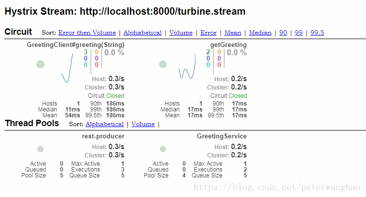

# 集群监控Turbine

Netflix Hystrix 可以为应用程序中的命令状态提供实时指标。这些数据通过一个名为Hystrix Dashboard的非常酷的界面以图形形式展现出来。但是它只能提供单个服务的信息，如果需要调用几十个微服务，我们希望看到的是这些微服务的性能，而不是一个微服务一个微服务的去查看。所以我们需要一个工具能让我们汇总系统内多个服务的数据并显示到Hystrix Dashboard上，使用Turbine可以做到这一点。

将Turbine集成到基于Spring-Cloud的应用中非常简单，只需要像以前一样拉入Turbine的依赖，定义好要集群哪些公开信息以及如何汇总有关特定集群的信息。

引入Tuebine依赖
```
<dependency>
			<groupId>org.springframework.cloud</groupId>
			<artifactId>spring-cloud-starter-turbine</artifactId>
		</dependency>
		<dependency>
			<groupId>org.springframework.cloud</groupId>
			<artifactId>spring-cloud-netflix-turbine</artifactId>
		</dependency>
		<dependency>
			<groupId>org.springframework.boot</groupId>
			<artifactId>spring-boot-starter-actuator</artifactId>
		</dependency>
		<dependency>
			<groupId>org.springframework.cloud</groupId>
			<artifactId>spring-cloud-starter-hystrix-dashboard</artifactId>
		</dependency>
```

在基于Spring Boot的应用程序中启用Turbine支持
```
@SpringBootApplication
@EnableHystrixDashboard
@EnableTurbine
public class DashboardTurbineApplication {
	public static void main(String[] args) {
		SpringApplication.run(DashboardTurbineApplication.class, args);
	}
}
```

最后是Turbine的配置
```
spring.application.name=hystrix-dashboard-turbine
server.port=8000
turbine.appConfig=consumer01,consumer02
turbine.aggregator.clusterConfig= default
turbine.clusterNameExpression= new String("default")
eureka.client.serviceUrl.defaultZone=${EUREKA_URI:http://localhost:8888/eureka}
```

 - turbine.appConfig ：配置Eureka中的serviceId列表，表明监控哪些服务
 - turbine.aggregator.clusterConfig ：配置集群的名字，也就是cluster。在Hystrix
   Dashboard中，使用http://turbine-hostname:port/turbine.stream?cluster=[clusterName] 来查看这个集群对应的服务的HystrixCommand信息。默认为default。
 - turbine.clusterNameExpression ： 是一个Spring表达式语言，用于获取集群的名称。默认是appName。

在本例中监控了2个微服务：consumer01，consumer02。
两个微服务的配置如下

```
spring.application.name=consumer01
server.port=8080

feign.hystrix.enabled=true
eureka.client.serviceUrl.defaultZone=${EUREKA_URI:http://localhost:8888/eureka}
```


```
spring.application.name=consumer02
server.port=8082
feign.hystrix.enabled=true

eureka.client.serviceUrl.defaultZone=${EUREKA_URI:http://localhost:8888/eureka}
```

依次启动Eureka服务注册中心，微服务和Turbine后，访问localhost:8000/hystrix.也就是turbine对应的hystrix。Hystrix Stream输入http://localhost:8000/turbine.stream 。分别访问两个业务服务，就可以在dashboard中看到他们的Hystrix Command信息了。


通过Hystrix Dashboard和Turbine, 我们能够很方便地监控每个Hystrix的运行情况, 在出现问题的时候能够及时定位到问题所在的服务。