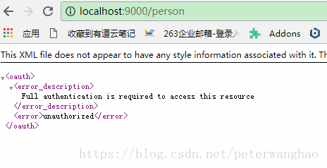
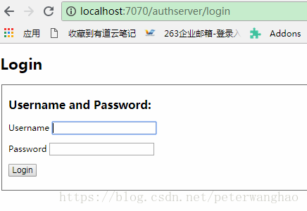
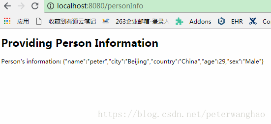
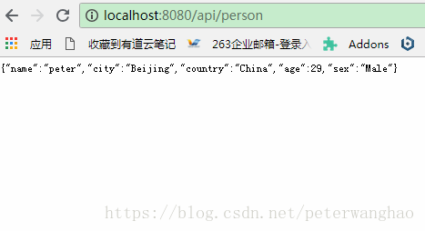

# 第二节 集成OAuth2

## 1. 概述
Spring Cloud 的安全模块可以为Spring Boot应用提供基于令牌的安全特性。具体讲就是支持OAuth2协议来实现单点登录（SSO），可以很方便地在资源服务之间传递身份令牌，以及使用嵌入式的ZUUL代理来配置下游服务的认证。

在这节中，我们将介绍如何在Spring Boot 客户端应用、身份认证服务与提供REST API的资源服务之间配置完成这些功能。实现系统的安全访问控制、身份认证和单点登录。

在这个例子中，我们使用了2个客户端应用程序来演示云安全特性中的SSO，只不过这2个应用是一样的。

## 2. 创建云安全应用
首先在所有Spring Boot应用中配置SSO，需要增加spring-cloud-starter-oauth2依赖：
```
<dependency>
    <groupId>org.springframework.cloud</groupId>
    <artifactId>spring-cloud-starter-oauth2</artifactId>
    <version>1.2.2.RELEASE</version>
</dependency>
```
它会自动包含spring-cloud-starter-security依赖。

然后配置一个应用作为身份认证服务，认证服务部署为[http://localhost:7070/authserver](http://localhost:7070/authserver)。认证服务使用JWT令牌。

由于有多个客户端来连接Spring OAuth2 Auth Server，需要在配置类里为inMemory生成器定义多个withClients。
```
@Override
	public void configure(ClientDetailsServiceConfigurer clients) throws Exception {
		clients.inMemory()
				.withClient("first").secret("passwordforauthserver")
				.redirectUris("http://localhost:8080/").authorizedGrantTypes("authorization_code", "refresh_token")
				.scopes("myscope").autoApprove(true).accessTokenValiditySeconds(30).refreshTokenValiditySeconds(1800)
			   .and()
				.withClient("second").secret("passwordforauthserver")
				.redirectUris("http://localhost:8081/").authorizedGrantTypes("authorization_code", "refresh_token")
				.scopes("myscope").autoApprove(true).accessTokenValiditySeconds(30).refreshTokenValiditySeconds(1800);
	}
```

另外需要配置一个资源服务，代表受保护的服务。服务端口为9000。

提供REST服务接口供客户端调用。
```
@RestController
public class PersonInfoController {

    @GetMapping("/person")
    @PreAuthorize("hasAnyRole('ADMIN', 'USER')")
    public @ResponseBody Person personInfo() {
        return new Person("peter", "Beijing", "China", 29, "Male");
    }   
}
```

同时提供一个/usr接口供客户端来获得用户的凭证。
```
@RestController
public class ResourceController {

    @RequestMapping("/user")
    public Principal user(Principal user) {
      return user;
    }

}
```

最后是客户端应用，在配置类里增加安全注解：
```
@Configuration
@EnableOAuth2Sso
public class SiteSecurityConfigurer
  extends WebSecurityConfigurerAdapter {
  
    @Override
    protected void configure(HttpSecurity http) throws Exception {
        // ...    
    }
}
```
任何需要身份验证的请求都将被重定向到授权服务器。为此，我们还必须定义服务器属性：
```
security:
  oauth2:
    client:
      accessTokenUri: http://localhost:7070/authserver/oauth/token
      userAuthorizationUri: http://localhost:7070/authserver/oauth/authorize
      clientId: first
      clientSecret: passwordforauthserver
    resource:
      userInfoUri: http://localhost:9000/user
```
## 3. 传递令牌
当传递令牌时，OAuth2客户端将其接收到的OAuth2令牌转发给资源服务。由于我们已经声明了@EnableOauth2Sso注解，Spring Boot 会在请求上下文中添加一个OAuth2ClientContext对象，因此我们可以在客户端应用程序中创建自己的OAuth2RestTemplate。
```
@Bean
public OAuth2RestOperations restOperations(
  OAuth2ProtectedResourceDetails resource, OAuth2ClientContext context) {
    return new OAuth2RestTemplate(resource, context);
}
```
一旦我们配置了这个Bean，上下文就会将访问令牌转发给所请求的服务，并且如果令牌到期了也将会刷新令牌。

## 4. 使用RestTemplate传递OAuth令牌
之前我们在客户端应用程序中定义了一个OAuth2RestTemplate 类型的restOperations bean。因此可以使用OAuth2RestTemplate中的getForObject() 方法来发送带有令牌的请求到受保护的资源服务。
```
@Autowired
private RestOperations restOperations;
 
@GetMapping("/personInfo")
public ModelAndView person() { 
    ModelAndView mav = new ModelAndView("personinfo");
    String personResourceUrl = "http://localhost:9000/person";
    mav.addObject("person", 
      restOperations.getForObject(personResourceUrl, String.class));       
     
    return mav;
}
```

## 5. 配置Zuul传递令牌
如果我们想把一个令牌转发给代理服务，我们可以使用Spring Cloud Zuul嵌入式反向代理。

在客户端应用中引入Zuul依赖
```
<dependency>
    <groupId>org.springframework.cloud</groupId>
    <artifactId>spring-cloud-starter-zuul</artifactId>
</dependency>
```
然后在配置类里添加@EnableZuulProxy 注解
```
@Configuration
@EnableOAuth2Sso
@EnableZuulProxy
public class SiteSecurityConfigurer
  extends WebSecurityConfigurerAdapter {
    //...
}
```
同时在application.yml 文件里添加Zuul的配置项
```
zuul:
  routes:
    resource:
      path: /api/**
      url: http://localhost:9000
    user: 
      path: /user/**
      url: http://localhost:9000/user
```
这样任何访问客户端应用/api端点的请求被重定向到资源服务的URL。这些请求都会带着OAuth令牌。

## 6. 运行效果
直接访问受保护的资源服务，显示未认证



访问客户端[http://localhost:8080/personInfo](http://localhost:8080/personInfo)，重定向到身份认证页面



输入用户名、密码（user/user），显示资源服务数据



通过Zuul代理访问资源服务



## 7. 总结
在这节中，我们讨论了如何使用Spring Cloud Security的OAuth2和Zuul来配置安全的认证服务和资源服务，以及使用Oauth2RestTemplate和嵌入的Zuul代理在服务之间传递OAuth2令牌。