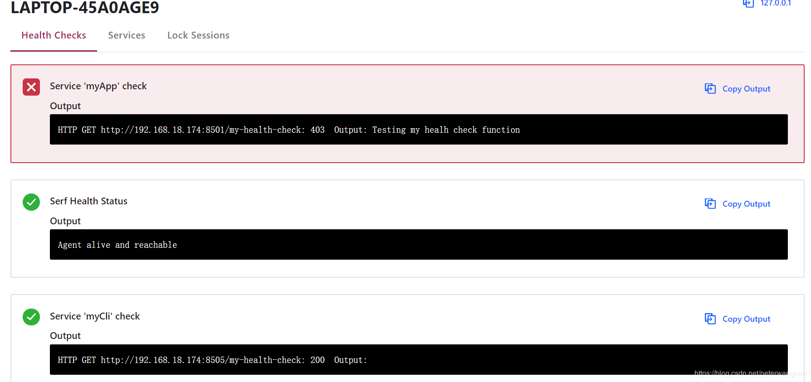

# 第一节 集成Consul

## 1.概述

Consul 是 HashiCorp 公司推出的开源工具，用于实现分布式系统的服务发现与配置。与其他分布式服务注册与发现的方案，Consul的方案更“一站式”，内置了服务注册与发现框 架、分布一致性协议实现、健康检查、Key/Value存储、多数据中心方案，不再需要依赖其他工具（比如ZooKeeper等）。

Consul是一个工具，提供解决微服务架构中一些最常见挑战的组件：
- 服务发现 - 自动注册和取消注册服务实例的网络位置
- 运行状况检查 - 检测服务实例何时启动并运行
- 分布式配置 - 确保所有服务实例使用相同的配置

Spring Cloud Consul 项目提供Spring Boot 集成 Consul的非常轻松的方法。在本文中，我们将了解如何配置Spring Boot应用程序来使用Consul。

## 2.先决条件

首先，建议您快速查看[Consul](https://www.consul.io/intro/)及其所有功能。

在本文中，我们将使用在localhost：8500上运行的Consul代理。有关如何安装Consul和运行代理的更多详细信息，请参阅此[链接](https://www.consul.io/intro/getting-started/install.html)。

在windows下安装Consul,
去官网下载：[https://www.consul.io/downloads.html](https://www.consul.io/downloads.html)

解压到某个目录下。cmd启动：
```
consul agent -dev
```

## 3.引入依赖
首先，我们需要在我们的pom.xml中添加spring-cloud-starter-consul-all依赖项：
```
<dependency>
    <groupId>org.springframework.cloud</groupId>
    <artifactId>spring-cloud-starter-consul-all</artifactId>
    <version>1.3.0.RELEASE</version>
</dependency>
```

## 4.服务发现

### 4.1 服务注册
让我们编写我们的第一个Spring Boot应用程序并与正在运行的Consul代理连接：
```
@SpringBootApplication
public class ServiceDiscoveryApplication {
	public static void main(String[] args) {
		new SpringApplicationBuilder(ServiceDiscoveryApplication.class).web(true).run(args);
	}
}
```

默认情况下，Spring Boot将尝试连接到localhost：8500上的Consul代理。要使用其他设置，我们需要更新application.yml文件：
```
spring:
  application:
    name: myApp
  cloud:
    consul:
      host: localhost
      port: 8500
```

然后，我们在浏览器 http://localhost:8500 访问Consul代理的站点，我们将看到我们的应用程序在Consul中正确注册。

要想自定义显示的标识符，我们需要使用另一个表达式更新属性spring.cloud.discovery.instanceId：
```
spring:
  application:
    name: myApp
  cloud:
    consul:
      discovery:
        instanceId: ${spring.application.name}:${random.value}
```

如果我们再次运行此应用程序，我们将看到它是使用标识符“MyApp”加上随机值注册的。使用random.value是想在本地机器上运行应用程序的多个实例。

如果想要禁用Service Discovery，我们可以将属性spring.cloud.consul.discovery.enabled设置为false。

### 4.2 寻找服务

我们已经在Consul中注册了我们的应用程序，但客户如何找到服务端点呢？我们需要一个客户端服务来从Consul中获取运行和可用的服务。

Spring 为此提供了DiscoveryClient API，我们可以使用@EnableDiscoveryClient注释启用它：
```
@SpringBootApplication
@EnableDiscoveryClient
public class DiscoveryClientApplication {
	public static void main(String[] args) {
		new SpringApplicationBuilder(DiscoveryClientApplication.class).web(true).run(args);
	}
}
```

然后，我们可以将DiscoveryClient bean注入到我们的controller控制器：
```
@RestController
public class DiscoveryClientController {
  
    @Autowired
    private DiscoveryClient discoveryClient;
 
    public Optional<URI> serviceUrl() {
        return discoveryClient.getInstances("myApp")
          .stream()
          .map(si -> si.getUri());
          .findFirst()
    }
}
```

最后，我们将定义我们的应用程序端点：
```
@GetMapping("/discoveryClient")
	public String discoveryPing() throws RestClientException, ServiceUnavailableException {
	URI service = serviceUrl().map(s -> s.resolve("/ping")).orElseThrow(ServiceUnavailableException::new);
	return restTemplate.getForEntity(service, String.class).getBody();
}

@GetMapping("/ping")
public String ping() {
	return "Client ping";
}
```

其中“myApp/ping”的路径是Spring应用程序的名称与服务端点。Consul将提供名为“myApp”的所有可用应用程序。

## 5.健康检查

Consul会定期检查服务端点的运行状况。

默认情况下，如果应用程序启动，Spring会访问运行状况端点以返回200 OK来判断服务是正常的。如果我们想要自定义端点，我们必须更新application.yml：
```
spring:
  cloud:
    consul:
      discovery:
        healthCheckPath: /my-health-check
        healthCheckInterval: 20s
```

Consul将每20秒轮询一次“/my-health-check”端点。

假设我们故意将自定义的运行状态检查服务返回FORBIDDEN状态：
```
@GetMapping("/my-health-check")
public ResponseEntity<String> myCustomCheck() {
	String message = "Testing my healh check function";
	return new ResponseEntity<>(message, HttpStatus.FORBIDDEN);
}
```

如果我们去Consul代理网站查看，我们会看到我们的应用程序健康检测是失败的。要解决此问题，“/my-health-check”服务应返回HTTP 200 OK状态代码。


健康检测详情



## 6.分布式配置

此功能允许在所有服务之间同步配置。Consul将监视任何配置更改，然后触发所有服务的更新。

首先，我们需要将spring-cloud-starter-consul-config依赖项添加到我们的pom.xml：
```
<dependency>
    <groupId>org.springframework.cloud</groupId>
    <artifactId>spring-cloud-starter-consul-config</artifactId>
    <version>1.3.0.RELEASE</version>
</dependency>
```

我们还需要将Consul和Spring应用程序的设置从application.yml文件移动到Spring首先加载的bootstrap.yml文件中。

然后，我们需要启用Spring Cloud Consul Config：
```
spring:
  application:
    name: myPro
  cloud:
    consul:
      host: localhost
      port: 8500
      config:
        enabled: true
server:
  port: 8509
```

Spring Cloud Consul Config将在“/config/myPro”中查找Consul中的属性。因此，如果我们有一个名为“my.prop”的属性，我们需要在Consul代理站点中创建此属性。

我们可以通过访问“KEY/VALUE”界面来创建属性，然后在“Create Key”表单中输入“/config/myPro/my/prop”，填入“Hello World”作为值。最后保存此值。

现在，让我们看看带有注入属性的控制器是什么样的：
```
@RestController
public class DistributedPropertiesController {
	@Value("${my.prop}")
	String value;

	@Autowired
	private MyProperties properties;

	@GetMapping("/getConfigFromValue")
	public String getConfigFromValue() {
		return value;
	}

	@GetMapping("/getConfigFromProperty")
	public String getConfigFromProperty() {
		return properties.getProp();
	}
}
```

MyProperties类：
```
@RefreshScope
@Configuration
@ConfigurationProperties("my")
public class MyProperties {
	private String prop;

	public String getProp() {
		return prop;
	}

	public void setProp(String prop) {
		this.prop = prop;
	}
}
```

如果我们运行应用程序，则通过字段值和属性来取值都会获得“Hello World”值。

### 6.1 更新配置

如何在不重新启动Spring Boot应用程序的情况下更新配置？

我们返回Consul代理站点并使用“New Hello World”更新属性“/config/myPro/my/prop ”，而其他不变。则字段属性将更新为预期的那样：“New Hello World”。

这是因为字段属性是MyProperties类具有@RefreshScope注释。使用@RefreshScope注释注释的所有bean 将在配置更改后刷新。

在实际应用场景中我们不应该直接在Consul中设置属性，我们应该将它们永久存储在某个地方。我们可以使用一个Config Server来完成此操作。

## 7. 结论

在本文中，我们已经了解了如何设置Spring Boot应用程序以与Consul一起使用以进行服务发现，自定义运行状况检查规则和共享分布式配置。